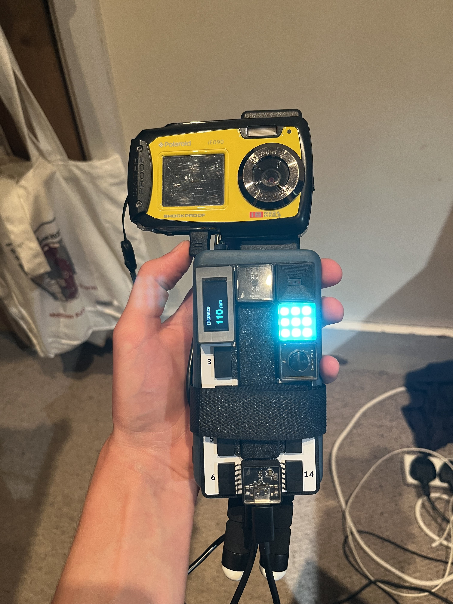
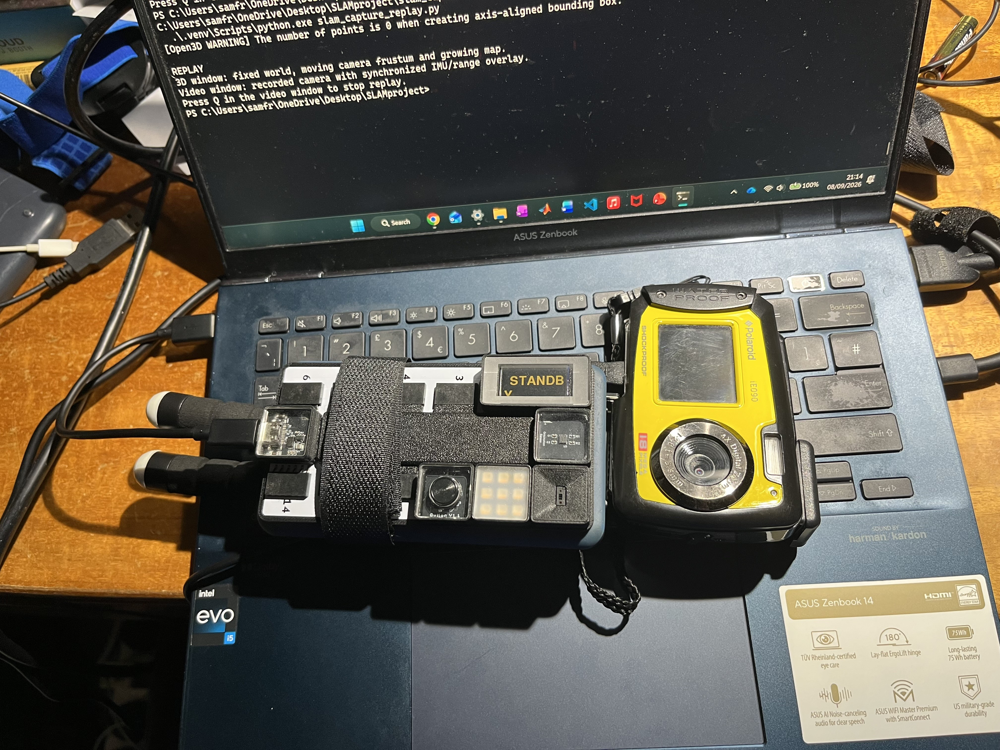
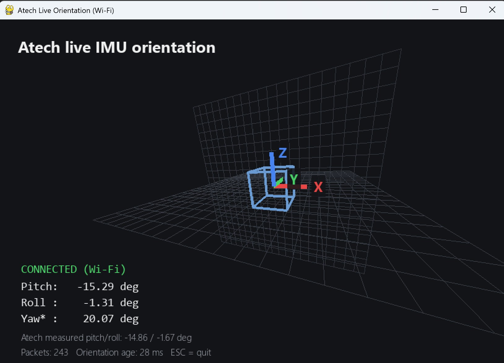
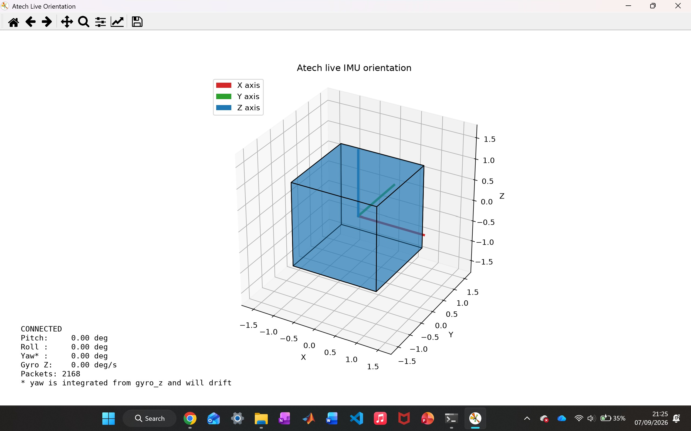
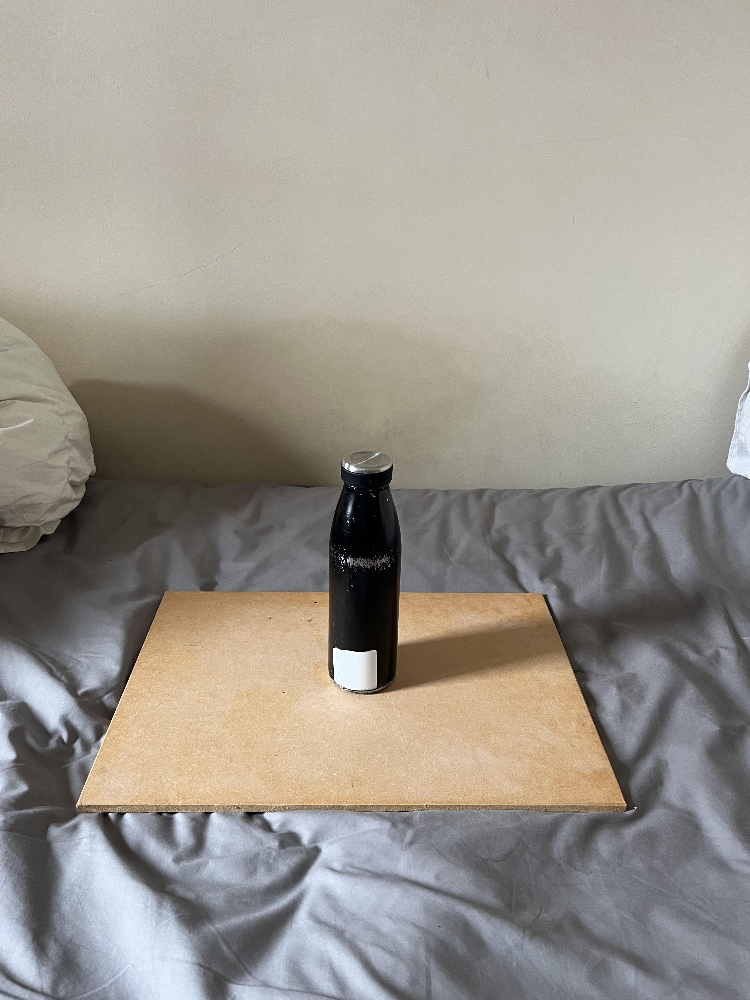
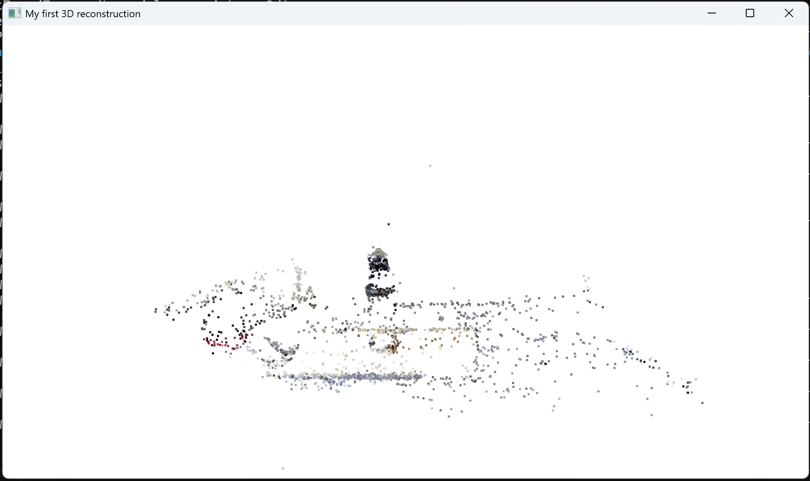
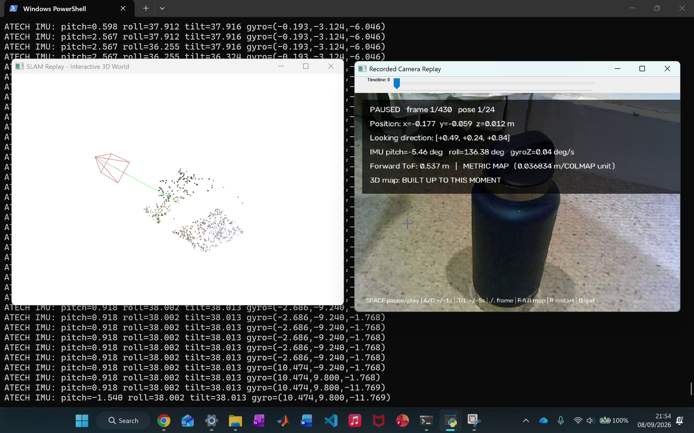

# Handheld SLAM

A low-cost handheld mapping prototype built to explore simultaneous localisation and mapping.

The system combines a monocular camera, orientation sensing and short-range distance measurements. It can reconstruct a sparse 3D map, estimate camera movement, show viewing direction and give the reconstruction an approximate real-world scale.

This project was developed as part of my engineering work for a Peru travel grant. I later plan to use what I learned from building it when visiting UTEC and the NASA-UNSA collaboration in Peru.

[Demo Video](https://youtu.be/QS8kUJ4V7ZA)

## Goal

The aim was to build a handheld system that could:

- observe its surroundings with a standard camera
- estimate its movement and orientation
- measure real-world distance
- construct a 3D representation of the scene
- show where the device is and which direction it is facing

The current system is a working proof of concept rather than a finished real-time SLAM platform.

## Hardware

The prototype uses:

- Atech.dev development kit
- Polaroid iE090 digital camera
- power bank
- Elegoo Uno
- short-range distance sensor
- LED lighting
- tripod / selfie-stick mounting hardware

The camera and sensors were mounted close together so that their measurements came from approximately the same physical position.

<p align="center">
  
  
  
</p>

## Software

The project is mainly written in Python and uses OpenCV, COLMAP, Open3D, Atech.dev firmware and some ROS 2 experimentation.

## Camera and orientation

The Polaroid camera provides the video feed used for visual reconstruction.

Relevant files:

- `polaroid_live.py`
- `polaroid_recorder.py`

The Atech board provides orientation information. I first built a simple 3D orientation viewer, then moved the sensor connection to Wi-Fi so the handheld system could operate without being tethered to the laptop.

Relevant files:

- `atech_orientation_viewer.py`
- `atech_orientation_viewer_wifi.py`

<p align="center">
  
  
</p>

## 3D reconstruction

A short video was sampled into 62 frames and processed with COLMAP. SIFT features and sequential feature matching were used to estimate camera movement and triangulate common points in the scene.

COLMAP registered 61 of the 62 frames and produced a recognisable coloured 3D point cloud, which was then viewed in Open3D.

Relevant files:

- `video_to_3d.py`
- `clean_model.py`
- `slam_reconstruction/`

<p align="center">
  
  
</p>

## Combined mapping program

The main program records camera, orientation and distance data over the same period and replays the result in a 3D virtual environment.

Run a capture:

```powershell
.\.venv\Scripts\python.exe slam_capture_replay.py
